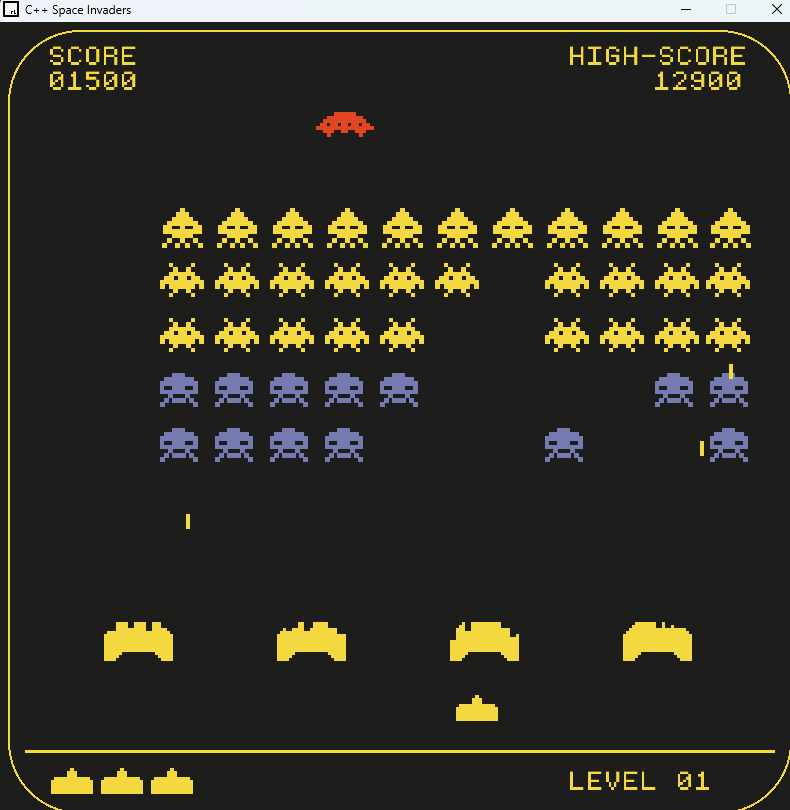

# Space Invaders




## About the Project

A classic Space Invaders game developed in C++ and 'Raylib'. The objective of the game is to defeat waves of aliens with a laser cannon to earn as many points as possible.

### Built With

- C++
- Raylib

## Getting Started

To get a local copy up and running follow these simple steps.

### Prerequisites

- C++ Compiler (e.g., GCC, Clang, Visual Studio)
- Raylib 5.0

### Installation

1. Clone the repo
   ```sh
   git clone https://github.com/RajAdarsh2022/space-invaders.git

2. Open the main.cpp file from src folder and press F5 to execute the game

## How to play

1. Use the arrow keys to move your spaceship left and right.
2. Press the space bar to shoot the aliens.
3. Avoid getting hit by the aliens or their projectiles.
4. Destroy all aliens to progress to the next level.

